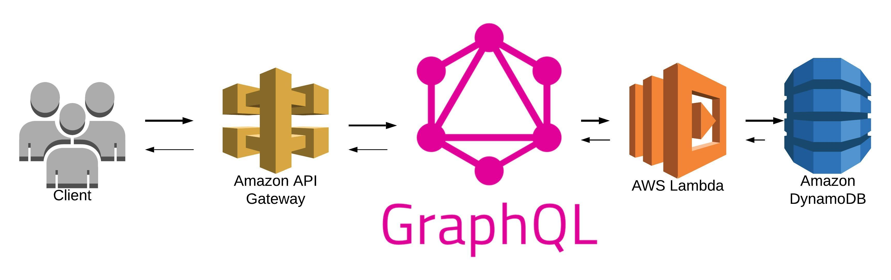

# Serverless Framework + grapgQL + Lambda Function + dynamoDB 
In this article I intend to show you how to create a SERVELESS project locally and be able to deploy it to AWS, using the Serverless Framework

# ARCHITECTURE
 

## What will we do?

### Install the serverless cli
```
npm install -g serverless
```

### Or, update the serverless cli from a previous version
```
npm update -g serverless
```
### Create Lambda Function
so let's create a new project using the Serverless Framework

First create a project using the templeate of Node, more information https://serverless.com/framework/docs/providers/aws/cli-reference/create/
```
serverless create --template aws-nodejs --path myService
```

 We are going to create a GraphQL project using Apollo as a GraphQL client. In the following link you can find all the necessary information to configure graphQL in a function lamda https://www.apollographql.com/docs/apollo-server/deployment/lambda/

### Then we move to the generated project, install some packages or plugin like:

```
npm install serverless-dynamodb-local --save-dev
npm install serverless-offline --save-dev
npm install aws-sdk --save-dev
npm install uuid --save
npm install axios --save
```
Some will be asking for these packages or libraries?

Well, we will use DynamoDb as a noSql database to persist all our information

We will use the Offline plungin to run and test our Lambda Function locally

We will use the UUID package to generate our Primary Key since Dynamo does not allow us to have a self-incremental

Finally we add the DynamoDB plugin locally
```
serverless dynamodb install
```

## We will start by configuring the serverless.yml file
The Serverless Framework allows us to define DynamoDB permissions within serverless.yml. We will define the Dynamo permissions as follows

# serverless.yml

```
service: slsgraph
#app: your-app-name
#tenant: your-tenant-name

# You can pin your service to only deploy with a specific Serverless version

provider:
  name: aws
  runtime: nodejs10.x
  stage: dev

  environment:
    CUSTOMER_TABLE: customer-table-${self:provider.stage}


  iamRoleStatements:
    - Effect: Allow
      Action:
        - dynamodb:Query
        - dynamodb:Scan  
        - dynamodb:GetItem
        - dynamodb:PutItem
        - dynamodb:UpdateItem
        - dynamodb:DeleteItem
      Resource: "arn:aws:dynamodb:${opt:region, self:provider.region}:*:table/${self:provider.environment.CUSTOMER_TABLE}"

```


### Now we define the configuration of our database and the table that we will use as well as the main properties of the table
```
resources:
  Resources:
    TodosDynamoDbTable: 
      Type: AWS::DynamoDB::Table
      DeletionPolicy: Retain
      Properties:
        AttributeDefinitions:
          - AttributeName: id
            AttributeType: S
        KeySchema:
          - AttributeName: id
            KeyType: HASH
        ProvisionedThroughput:
          ReadCapacityUnits: 1
          WriteCapacityUnits: 1
        TableName: ${self:provider.environment.DYNAMODB_TABLE}
```


### Define the plugins
```
plugins:
  - serverless-dynamodb-local
  - serverless-offline
```
### Note:
Make sure that serverless-dynamodb-local is above serverless-offline so it will be loaded earlier.

Now your local DynamoDB database will be automatically started before running serverless offline.


### we also define the function and the http events in the serverless.yml file

```
functions:
  graphql:
    # this is formatted as <FILENAME>.<HANDLER>
    handler: handler.graphqlHandler
    environment:
      URL_API: https://www.myapi.com/api/
    events:
    - http:
        path: graphql
        method: post
        cors: true
    - http:
        path: graphql
        method: get
        cors: true
```

And finally and not least we define the Dynamo configuration in the same serverless.yml file
```
custom:
  dynamodb:
  # If you only want to use DynamoDB Local in some stages, declare them here
    stages:
      - dev
    start:
      port: 8000
      sharedDb: true
      migrate: true
```
Note: The -migrate parameter is necessary so that our table can be created correctly as soon as we execute our project, more information in https://www.npmjs.com/package/serverless-dynamodb-local

# handler.js
Now we are going to define our code, initially the main file handler.js

Where we will have the configuration of the Lambda Function with GraphQL
````
"use strict";

const { ApolloServer } = require("apollo-server-lambda");
const typeDefs = require('./schema');
const resolvers = require('./resolvers');

const server = new ApolloServer({ typeDefs, resolvers });
exports.graphqlHandler = server.createHandler();

````

# resolvers.js

Package import and configuration of dynamoDB
```
const Axios = require("axios");
const uuidv1 = require('uuid/v1');

const url_api = process.env.URL_API;
const customerTable = process.env.CUSTOMER_TABLE;

const AWS = require("aws-sdk");

let options = {};
if (process.env.IS_OFFLINE) {
  options = {
    region: "localhost",
    endpoint: "http://localhost:8000"
  };
}
const dynamoDb = new AWS.DynamoDB.DocumentClient(options);

```

If we want to consult an external API you can use this Function fetchCountry
```
const fetchCountry = async () => {
  const results = await Axios.get(`${url_api}countries?operation=NO`);
  console.log(results.data);
  return results.data;
};
```

This function allows us to create a new Client using the Dynamo Put method

```
const createCustomer = async (args) => {
  const params = {
    TableName: customerTable,
    Item: {
      ID: uuidv1(),
      ...args
    },
    ReturnValues: "ALL_OLD"
  };

  return new Promise((resolve, reject) => {
    dynamoDb.put(params, (err, data) => {
      if (err) {
        reject(false);
      } else {
        resolve(true);
      }
    });
  });
};
```


This function allows us to get a Customer by passing the Customer ID as a parameter

    const getCustomer = ID => {
        const params = {
            TableName: customerTable,
            Key: { ID }
        };

        return new Promise((resolve, reject) => {
            dynamoDb.get(params, (err, data) => {
            if (err) {
                reject(false);
            } else {
                resolve(data.Item);
            }
            });
        });
    };

This function allows us to get all Customers

    const getAllCustomers = () => {
        const params = {
            TableName: customerTable
        };

        return new Promise((resolve, reject) => {
            dynamoDb.scan(params, (err, data) => {
            if (err) {
                console.log("error: ", err);
                reject(false);
            } else {
                console.log("Resolve: ", data);
                resolve(data.Items);
            }
            });
        });
    };


And finally we configure our Resolvers

Provide resolver functions for your schema fields

    const resolvers = {
        Query: {
            Country: () => fetchCountry(),
            Customer: (_, { ID }) => getCustomer(ID),
            Customers: () => getAllCustomers(),
        },
        Mutation: {
            CreateCustomer: (_, data) => createCustomer(data)
        }
    };

    module.exports = resolvers;

# eschema.js
And the last thing we will do is configure our GraphQL scheme
````
const { gql } = require("apollo-server-lambda");

// Construct a schema, using GraphQL schema language
const typeDefs = gql`
  type Country {
    id: String
    name: String
  }
  
  type Customer {
    ID: String
    FullName: String
    FirstName: String
    SecondName: String
    LastName: String
    SecondLastName: String
    Address: String
    Phone1: String
    Email: String
  }

  type Query {
    Country: [Country]
    Customers: [Customer]
    Customer(ID: String!): Customer
  }

  type Mutation {
    CreateCustomer(
      FullName: String
      FirstName: String
      SecondName: String
      LastName: String
      SecondLastName: String
      Address: String
      Phone1: String
      Email: String
    ): Boolean
  }
`;
module.exports = typeDefs;
````

# Usage and command line options
In your project root run:

run dynamo local

  ```
  serverless dynamodb start
  ```
run all local

    serverless offline start


# Links
- https://docs.aws.amazon.com/amazondynamodb/latest/developerguide/HowItWorks.API.html
- https://docs.aws.amazon.com/sdk-for-javascript/v2/developer-guide/dynamodb-example-document-client.html
- https://serverless.com/framework/docs/getting-started/
- https://www.npmjs.com/package/serverless-offline
- https://www.npmjs.com/package/serverless-dynamodb-local
- https://www.apollographql.com/docs/apollo-server/

# Examples GraphQL Apollo using Playground
```
# Write your query or mutation here
#
 mutation CreateCustomer {
  CreateCustomer(
    FullName: "Yibson Alexis Leudo Romaña"
    FirstName:"Yibson"
    SecondName:"Alexis"
    LastName:"Leudo"
    SecondLastName:"Romaña"
  )
}

query GetCustomers {
  Customers {
    ID
    FullName
    FirstName
  }
}

query GetCustomers {
  Customers {
    ID
    FullName
    FirstName
  }
}

query GetCustomer {
  Customers {
    ID
    FullName
    FirstName
  }
}


query GetContries {
  Country{
    id
  }
}
```


 
